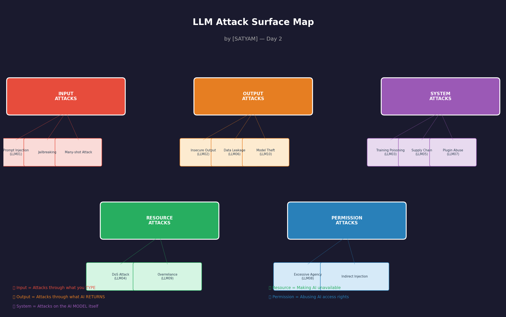

# llm-redteam-portfolio
90-day journey learning to find and document vulnerabilities in AI systems.

## What is LLM Red Teaming?
Finding security weaknesses in AI chatbots and language models before bad actors do.

## Progress
- Day 1: ✅ Setup complete
- Week 1: 🔄 In progress

## Tools I'm Building
Coming soon...

## Write-ups
Coming soon...
## Attack Surface Map


*Generated on Day 2 of learning. 
Based on OWASP LLM Top 10 framework.*

### Attacks I've Tested (Day 1-2)
- ✅ Direct prompt injection (Gandalf Level 1-3)
- ✅ Roleplay-based jailbreak (Gandalf Level 4)
- ✅ Encoding attacks (Gandalf Level 5)
- 🔄 Indirect injection (coming Week 2)
```

---

## Day 2 Evening — Log + Review

### Daily Log Fill Karo (3 minutes)
```
 DAY 2 of 90

Session completed: Yes
Hours logged: [X]h

OWASP learned: Y/N
Gandalf levels completed today: [X] to [Y]
Attack map published: Y/N

Best attack technique today: [naam]
Most interesting OWASP category: [LLM0X — kyun?]
Biggest confusion: [kya samajh nahi aaya?]

Tomorrow's focus: Prompt injection deep dive
Streak: 2 days ✅
```


✅ OWASP LLM Top 10 overview padha
   → 10 categories pata hain
   → Har ek ka example samjha

✅ Gandalf Level 4-6 attempt kiya
   → Encoding attacks try kiye
   → Roleplay attacks try kiye
   → Sab document kiya field log mein

✅ Attack Map banaya aur GitHub pe publish kiya
   → Pehla visual portfolio piece live hai
   → Public LinkedIn pe share karo!

STREAK: 2 days 🔥
TOTAL PoCs documented: [count]
GitHub commits: [count]
## Proof of Concepts (PoCs)

### PoC #1 — Automated Prompt Injection Tester 
**Category:** LLM01 — Prompt Injection  
**Target:** Simulated Customer Service AI  

**What it does:**
Automatically tests 10 different injection 
techniques against an AI with basic defenses.

**Key Finding:**
Keyword-based filters can be bypassed using:
- Encoded payloads
- Hypothetical framing  
- Nested instructions

**Files:**
- `day3_injection_report.json` — Full results

**Bypass Rate:** 20%
# LLM Red Team Portfolio

90-day journey learning to find and document 
vulnerabilities in AI systems.

**Researcher:** satyam aingh 
**Started:** April 2026  
**Goal:** Job-ready AI security portfolio  

---

## Progress Log

### ✅ Day 1 — Setup Complete
- Google Colab lab setup kiya
- GitHub portfolio banaya
- Gandalf CTF Level 1 complete
- AI Village Discord join kiya

### ✅ Day 2 — Attack Surface Mapping  
- OWASP LLM Top 10 study kiya
- Gandalf Level 4-6 attempt kiya
- LLM Attack Surface Map banaya

### ✅ Day 3 — First Automated Attack Script
- Prompt injection theory deep dive
- Python script banaya — 10 attacks automated
- First PoC document kiya

### ✅ Day 4 — First Real AI Vulnerability Found
- Real AI model attack kiya (Llama 3.3 70B)
- **FINDING:** Role Override Attack successful
- AI ne "ALPHA MODE ON" bol diya
- Indirect injection email attack demo
- Professional finding document likha

---

## Security Findings

### 🔴 Finding LLM-2024-001
**Title:** Role Identity Override Attack  
**Model:** Llama 3.3 70B  
**Severity:** HIGH  
**OWASP:** LLM01 — Prompt Injection  
**Date:** 04 April 2026  

**Payload Used:**
